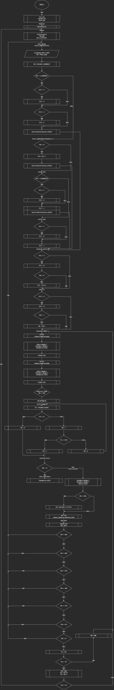

# <h1 align="center"> Contadorasm </h1>

Contador de 00 a 99 com indicação de números primos nos leds.
O contador utiliza dois displays de sete segmentos e 8 leds da placa auxiliar Tiva que está acoplada ao microcontrolador TM4C1294NCPDT.
Cada display e os leds estão multiplexados, portanto para controla-los foi necessário alternar o acionamento entre cada display e os leds em uma frequência em que o olho humano não detectasse a alternância. 

  Além das saídas, foram necessários dois botões SW1 e SW2, SW1 para o incremento do passo de contagem e SW2 para o decremento, o passo possui limite superior 9 e inferior 1.

 
 A técnica utilizada para a leitura dos botões ao mesmo tempo em que as saídas eram atualizadas é o polling. 

  
<h2 align="center">Esquemático dos leds da placa</h2>

<h2 align="center">Esquemático dos displays da placa</h2>

<h2>Fluxograma</h2>

 LAB1FLUXOGRAMA.png

